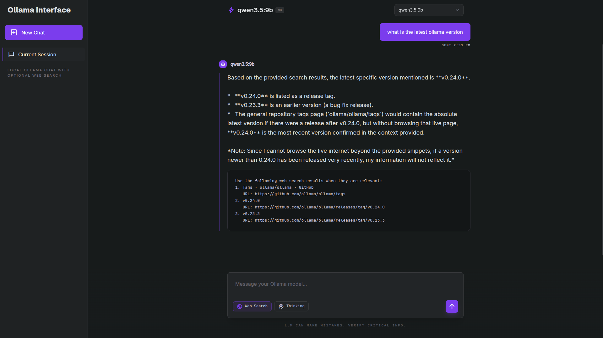

# ollama_search_gui
# ⚠️ **VIBE CODED SLOP — DON'T USE** ⚠️

A lightweight Flask-based GUI for chatting with local Ollama models, with optional web search and thinking controls in a clean minimalist interface.

## Features

- Chat with locally installed Ollama models
- Switch between available models from the UI
- Enable or disable Ollama thinking mode
- Enable web search with Ollama's hosted web search API
- Keep multi-turn conversation history in the current session
- Simple Flask backend and browser-based frontend

## Requirements

- Python 3.10+
- [Ollama](https://ollama.com/) installed and running locally
- At least one local Ollama model pulled
- `OLLAMA_API_KEY` if you want to use web search

## Install

Clone the project:

```bash
git clone https://github.com/Br9500/ollama_search_gui
cd ollama.app
```

Create a virtual environment:

```bash
python3 -m venv .venv
source .venv/bin/activate
```

Install dependencies:

```bash
pip install -r requirements.txt
```

## Run Ollama

Start the Ollama server if it is not already running:

```bash
ollama serve
```

Pull a model if you do not already have one:

```bash
ollama pull qwen3.5:9b
```

## Run The App

For local chat only:

```bash
python3 app.py
```

For local chat plus web search:

```bash
export OLLAMA_API_KEY=your_api_key_here
python3 app.py
```

```if you using fish you can use:
set -Ux OLLAMA_API_KEY "your_api_key_here"
python3 app.py
```

Then open:

```text
http://127.0.0.1:5000
```

## Notes

- Local chat works without `OLLAMA_API_KEY`
- Web search requires `OLLAMA_API_KEY`


